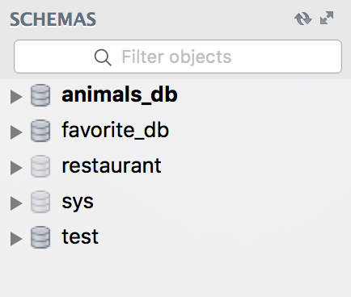
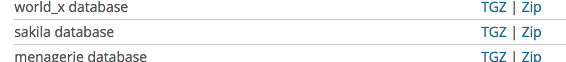
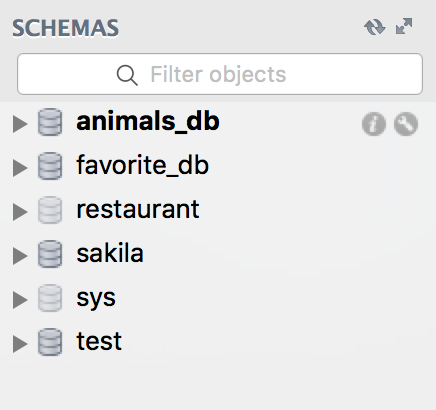

## SQL Workout

### Database
For this SQL workout, we loaded data from a sample database provided by MySQL named [Sakila](https://dev.mysql.com/doc/sakila/en/sakila-installation.html).

### Download the Sakila DB
- Visit [this page](https://dev.mysql.com/doc/index-other.html) and find the "sakila database" under the *Example Databases* header:

- Click on the ["Zip" link](http://downloads.mysql.com/docs/sakila-db.zip) to download. This contains a zipped directory of all the files required to load the sample database.

- On your computer, open the zip file, and **cd into the sakila-db directory that gets unzipped**. You should see three files:

### Installation of Sakila DB using the command line:
- First, run this command from your terminal (Terminal, Git Bash, etc.):
> mysql

- On a Mac, run these two commands:
> echo 'export PATH="$PATH:/usr/local/mysql/bin"' >> ~/.bash_profile
> source ~/.bash_profile

- Run this command:
> mysql -u root -p

- and enter your root user password that you generated as part of class.

Here's how we run:
`cd` into the sakila-db directory, and run

    mysql -u root -p

Once we’re in the sakila-db directory and have `mysql` running, we run the following two commands:

    SOURCE sakila-schema.sql;
    SOURCE sakila-data.sql;

`SOURCE` executes all the statements in a given SQL file, as SQL commands. `sakila-schema.sql` contains a number of `CREATE TABLE` statements to create the tables within our sample DB. `sakila-data.sql` contains the actual data that gets loaded into these tables.

Finally, we open MySQL Workbench or SQLPro or any SQL management, refresh our list of databases under the *SCHEMAS* header, and we should see our **sakila** DB:

